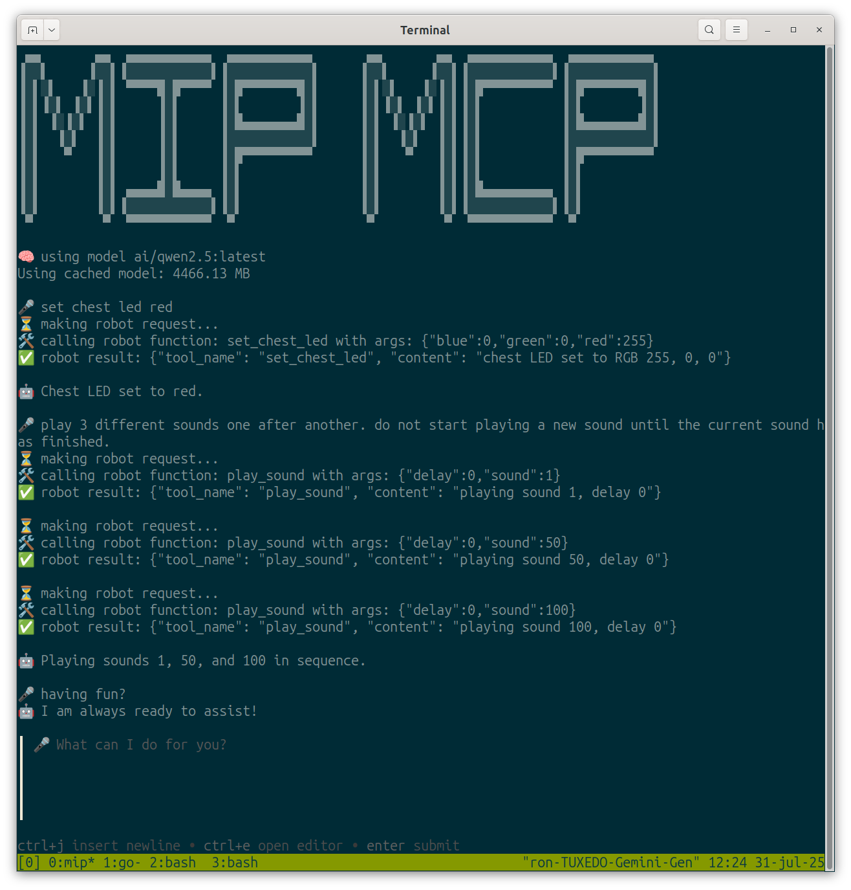

# MiP MCP Server



This example creates an [MCP server](https://modelcontextprotocol.io/overview) that provides tools for controlling the MiP robot from any model that has tool calling support.

## Running

```shell
go run ./examples/mcp [MAC address or Bluetooth ID]
```

Once it is running, you can call it from whatever MCP host/client that you wish.

For example, to run using the [`osprey`](https://github.com/k33g/osprey) command line utility using the [Docker Model Runner](https://docs.docker.com/ai/model-runner/) and the [Qwen2.5 model](https://hub.docker.com/r/ai/qwen2.5):


```shell
./examples/mcp/chat.sh
```

Now you can give MiP a command like this:

```
turn your chest LED to red 
```

### Other models

#### gemma3n

```
MODEL_RUNNER_TEMPERATURE=0.5 MODEL_RUNNER_TOOL_MODEL=ai/gemma3n:latest ./examples/mcp/chat.sh
```

#### smollm3

```
MODEL_RUNNER_TEMPERATURE=0.6 MODEL_RUNNER_TOOL_MODEL=ai/smollm3 ./examples/mcp/chat.sh
```

